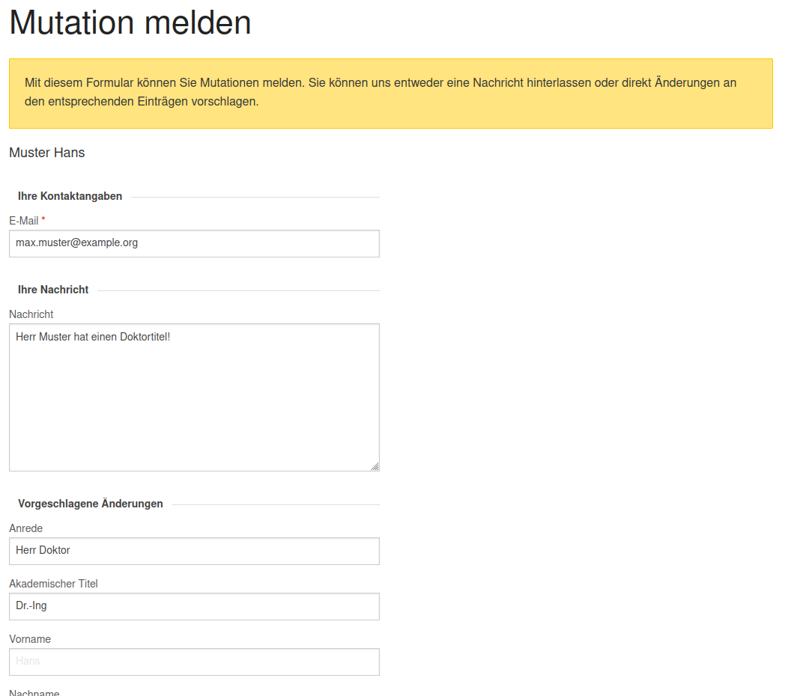
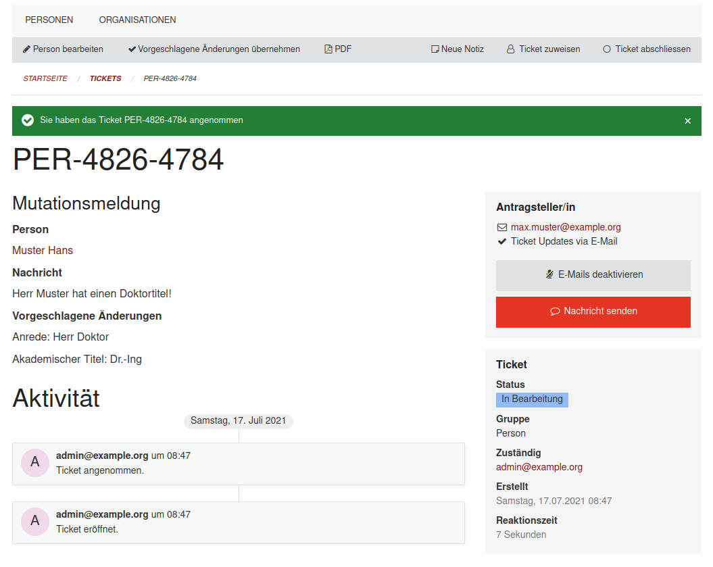
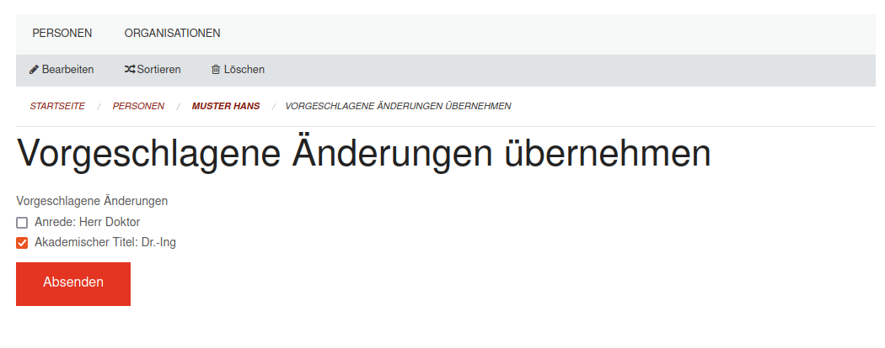

# Staatskalender: Verbesserte Mutationsmeldungen

*Release 2021.67*

Neu können bei Mutationsmeldungen von Personen und Organisationen direkt Änderungen für spezifische Felder vorgeschlagen werden. Redaktoren könnnen anschliessend mit wenigen Klicks auswählen, welche der vorgeschlagenen Änderung übernommen werden sollen.

*Mit dem neuen Formular für Muationsmeldungen können direkt Änderungen für konkrete Felder vorgeschlagen werden.*

*Ticketansicht mit neuen Informationen und Aktionen*

*Vorgeschlagene Änderungen können selektiv übernommen werden*
